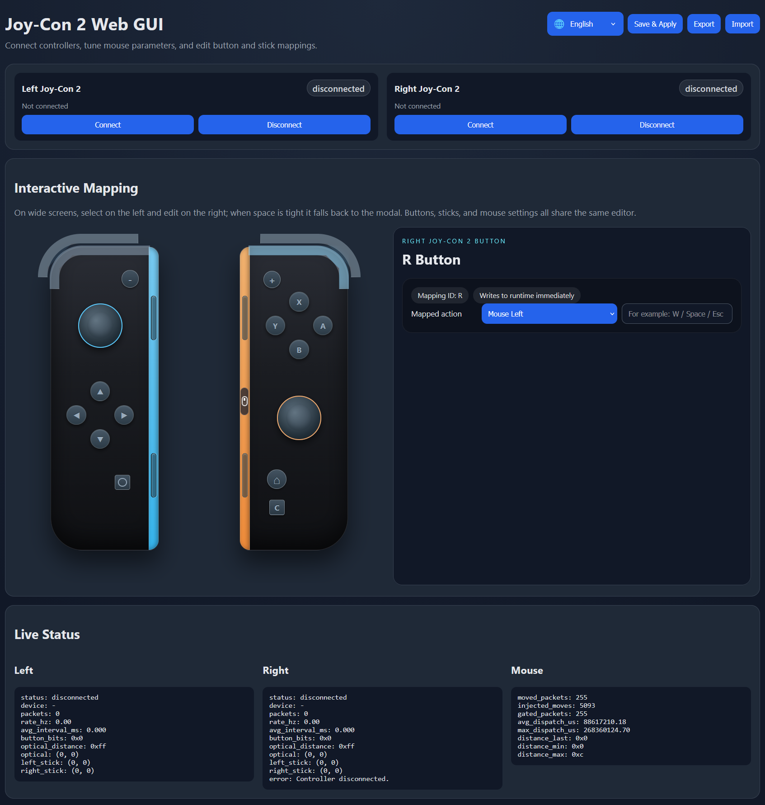

# JoyCon2MappingWebUI

English | [简体中文](README.zh-CN.md)

A local Windows tool written in C++ for connecting Joy-Con 2 controllers, reading controller input, and configuring button, stick, and mouse mappings through a local Web UI.

The project currently consists of two main parts:

- `transport`: Joy-Con 2 communication and protocol layer for device connection, input reading, and low-level abstraction
- `webgui`: local Web UI and runtime mapping layer for visual configuration and mapping controller input to mouse and keyboard actions

## Features

- Connect left and right Joy-Con 2 controllers and display their status
- Configure mappings through a local Web GUI
- Map buttons to mouse buttons or keyboard keys
- Configure directional stick mapping and deadzones
- Tune mouse-related parameters
- Configure the local Web UI port through the config file or frontend
- Import, export, save, and apply configuration
- Launch a local configuration page on `http://127.0.0.1:17777/` by default

## Screenshots

### UI




## Project Structure

```text
.
├─ CMakeLists.txt
├─ build_release.bat
├─ transport/    # Transport layer, protocol, and example programs
└─ webgui/       # Local Web server, mapping runtime, and frontend UI
```

## Build Requirements

This project is currently intended for Windows development. Recommended environment:

- Windows 10 / 11
- CMake 3.20 or newer
- Visual Studio with C++ development tools
- A compiler with C++20 support

## Build

### Option 1: Use the batch script

Run this in the repository root:

```bat
build_release.bat
```

The script will:

- Detect a usable Visual Studio build environment
- Create `build/` in the repository root
- Configure and build the `Release` target

### Option 2: Use CMake manually

```bat
cmake -S . -B build
cmake --build build --config Release
```

## Run

After building, run `JoyCon2Mapper`.

The program will:

- Start a local HTTP server
- Open the browser automatically at `http://127.0.0.1:17777/` by default
- Read and write `config.json` in the executable directory

The local service stops when the console application exits.

## Configuration

The main config structure now looks like this:

```json
{
  "mouse": {
    "left": {
      "enabled": true,
      "baseSensitivity": 0.1,
      "acceleration": 0.04,
      "exponent": 0.5,
      "maxGain": 2.5,
      "distanceThreshold": 12
    },
    "right": {
      "enabled": true,
      "baseSensitivity": 0.1,
      "acceleration": 0.04,
      "exponent": 0.5,
      "maxGain": 2.5,
      "distanceThreshold": 12
    }
  },
  "sticks": {
    "left": {
      "deadzone": 8000,
      "hysteresis": 1600,
      "diagonalUnlockRadius": 14000,
      "fourWayHysteresisDegrees": 12.0,
      "eightWayHysteresisDegrees": 8.0,
      "up": "key_w",
      "down": "key_s",
      "left": "key_a",
      "right": "key_d"
    },
    "right": {
      "deadzone": 8000,
      "hysteresis": 1600,
      "diagonalUnlockRadius": 14000,
      "fourWayHysteresisDegrees": 12.0,
      "eightWayHysteresisDegrees": 8.0,
      "up": "key_up",
      "down": "key_down",
      "left": "key_left",
      "right": "key_right"
    }
  },
  "server": {
    "port": 17777
  }
}
```

- `mouse.left` and `mouse.right` hold the optical mouse settings for each Joy-Con 2.
- `sticks.left` and `sticks.right` hold directional mapping and stick decision parameters.
- You can change the port from the frontend and the page will redirect automatically after saving.
- If the config file does not exist, the application writes a default one before starting the Web server.
- This means that even if the default port is already in use and server startup fails, you can still edit the generated config file manually and change `server.port`.

## Included Components

- `transport` provides the Joy-Con 2 low-level communication layer
- `webgui` provides the local API, configuration storage, mapping runtime, and frontend
- Static assets from `webgui/web` are copied automatically to the output directory after build

## References

This project was developed with ideas and inspiration from the following open-source projects:

- [TheFrano/joycon2cpp](https://github.com/TheFrano/joycon2cpp)
- [Logan-Gaillard/Joy2Win](https://github.com/Logan-Gaillard/Joy2Win)

Thanks to the authors of these projects for sharing their work.

## Notes

This README currently focuses on the overall project structure and basic usage. As the project evolves, it can be expanded with:

- A list of supported mappings
- Example configuration files
- FAQ and troubleshooting notes
