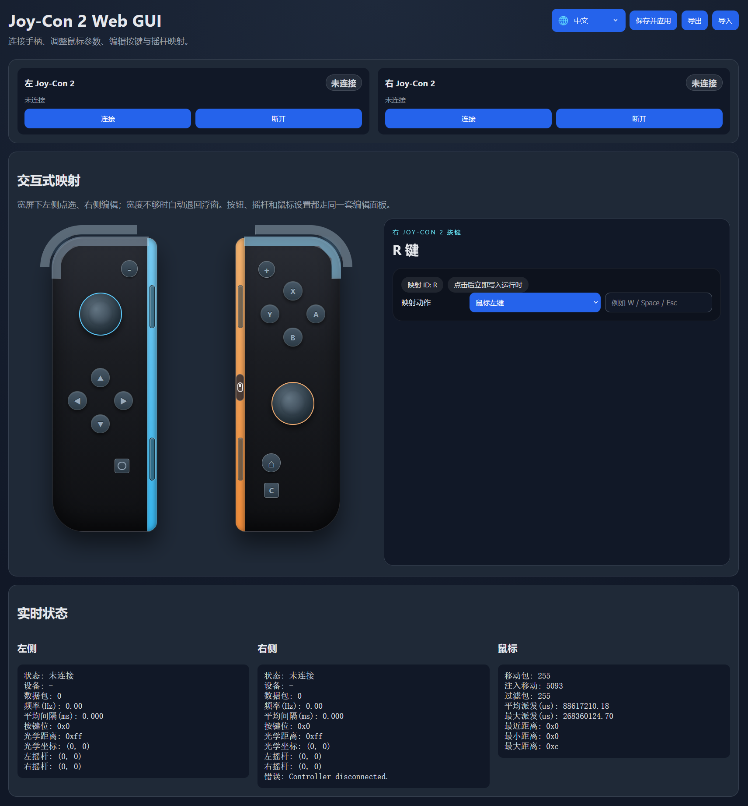

# JoyCon2MappingWebUI

[English](README.md) | 简体中文

一个基于 C++ 的 Windows 本地工具，用于连接 Joy-Con 2，读取手柄输入，并通过本地 Web 界面配置按键、摇杆和鼠标映射。

项目目前主要包含两部分：

- `transport`：Joy-Con 2 通信与协议层，负责设备连接、输入读取与底层封装
- `webgui`：本地 Web 配置界面与运行时映射逻辑，负责可视化编辑和将手柄输入映射为鼠标/键盘操作

## 功能简介

- 连接左右 Joy-Con 2，并显示连接状态
- 提供本地 Web GUI 进行映射配置
- 支持按钮映射到鼠标按键或键盘按键
- 支持左右摇杆方向映射与死区配置
- 支持鼠标参数调整
- 支持通过配置文件或前端修改本地 Web UI 端口
- 支持配置导入、导出、保存与应用
- 默认在 `http://127.0.0.1:17777/` 启动本地配置页面

## 界面截图


### 界面



## 项目结构

```text
.
├─ CMakeLists.txt
├─ build_release.bat
├─ transport/    # 底层传输、协议与示例程序
└─ webgui/       # 本地 Web 服务、映射运行时与前端页面
```

## 构建环境

当前项目面向 Windows 开发，建议环境：

- Windows 10 / 11
- CMake 3.20 及以上
- Visual Studio C++ 开发环境
- 支持 C++20 的编译器

## 构建方式

### 方式一：使用批处理脚本

在仓库根目录执行：

```bat
build_release.bat
```

脚本会：

- 自动查找 Visual Studio 编译环境
- 在根目录下创建 `build/`
- 配置并编译 `Release` 版本

### 方式二：手动使用 CMake

```bat
cmake -S . -B build
cmake --build build --config Release
```

## 运行说明

编译完成后可运行 `JoyCon2Mapper`。

程序会：

- 启动本地 HTTP 服务
- 默认自动打开浏览器访问 `http://127.0.0.1:17777/`
- 在程序目录下读写配置文件 `config.json`

关闭控制台程序后，本地服务会停止。

## 配置说明

当前配置文件中的关键结构如下：

```json
{
  "mouse": {
    "left": {
      "enabled": true,
      "baseSensitivity": 0.1,
      "acceleration": 0.04,
      "exponent": 0.5,
      "maxGain": 2.5,
      "distanceThreshold": 12
    },
    "right": {
      "enabled": true,
      "baseSensitivity": 0.1,
      "acceleration": 0.04,
      "exponent": 0.5,
      "maxGain": 2.5,
      "distanceThreshold": 12
    }
  },
  "sticks": {
    "left": {
      "deadzone": 8000,
      "hysteresis": 1600,
      "diagonalUnlockRadius": 14000,
      "fourWayHysteresisDegrees": 12.0,
      "eightWayHysteresisDegrees": 8.0,
      "up": "key_w",
      "down": "key_s",
      "left": "key_a",
      "right": "key_d"
    },
    "right": {
      "deadzone": 8000,
      "hysteresis": 1600,
      "diagonalUnlockRadius": 14000,
      "fourWayHysteresisDegrees": 12.0,
      "eightWayHysteresisDegrees": 8.0,
      "up": "key_up",
      "down": "key_down",
      "left": "key_left",
      "right": "key_right"
    }
  },
  "server": {
    "port": 17777
  }
}
```

- `mouse.left` / `mouse.right` 分别对应左右 Joy-Con 2 的光学鼠标参数。
- `sticks.left` / `sticks.right` 分别对应左右摇杆的方向映射与判定参数。
- 可以直接在前端修改端口，保存后页面会自动跳转到新地址。
- 如果配置文件不存在，程序会在启动 Web 服务前先写出一份默认配置。
- 因此即使默认端口已被占用导致启动失败，仍然可以手动编辑生成出来的配置文件，修改 `server.port` 后再重新启动。

## 已包含内容

- `transport` 中提供 Joy-Con 2 底层通信封装
- `webgui` 中提供本地 API、配置存储、映射运行时与前端页面
- 构建后会自动复制 `webgui/web` 静态资源到可执行文件目录

## 借鉴

本项目在实现过程中参考/借鉴了以下项目的思路与部分设计：

- [TheFrano/joycon2cpp](https://github.com/TheFrano/joycon2cpp)
- [Logan-Gaillard/Joy2Win](https://github.com/Logan-Gaillard/Joy2Win)

感谢上述开源项目提供的实现思路与参考。

## 说明

当前 README 主要用于介绍项目整体结构与基本使用方式；后续如功能继续扩展，可以再补充：

- 支持的按键映射列表
- 配置文件格式示例
- 常见问题与排错说明
